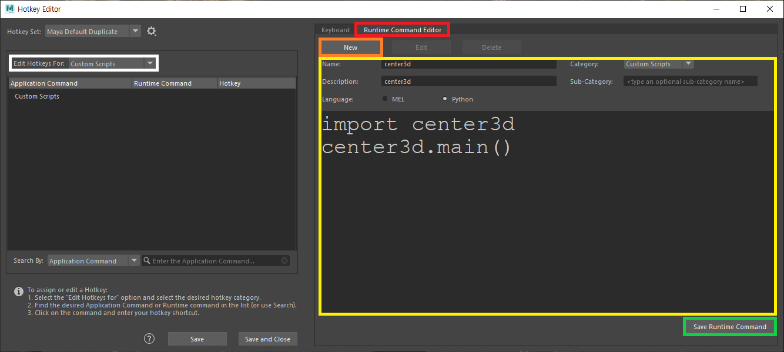
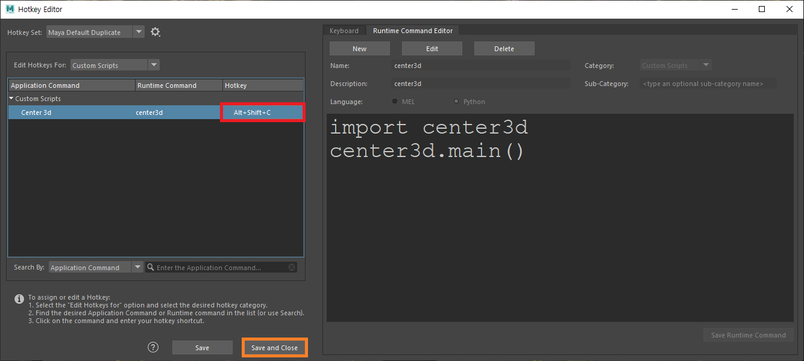

# Center3D

## What does it do
Center the selected transform(s) onto the camera view in Maya. Just like in 3DEqualizer.


## Installation

### 1. Copy `center3d.py` to:
- Windows
    > \Users\USERNAME\Documents\maya\scripts
- Mac
    > $HOME/maya/scripts
- Linux
    > $HOME/maya/scripts

### 2. Set Hotkey
1. Open **Hotkey Editor** (Windows > Settings/Preferences > Hotkey Editor)
1. Create a new 'Runtime Command'
    >  <br>
    > ```
    > import center3d
    > center3d.main()
    > ```
1. Set Hotkey
    >  <br>
    > e.g. `Alt + Shift + C`
1. Save and Close
